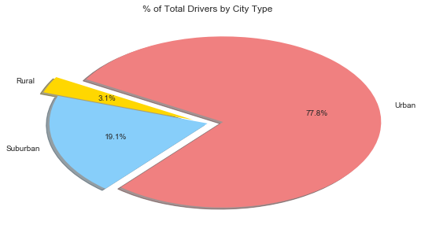

# Pyber Ride Sharing

### Analysis

* __Observed Trend 1__: Urban area has the most riders, drivers, and fares 
* __Observed Trend 2__: Rural area has the less riders and drivers, however, the total fares % is around 6.7% which is more than expected proportionally(riders =5.3%, riders=3.1%). This indicates that, the demand for drivers is higher and thus may cause riders more money to have a ride in the rural area per trip. (distance might be another possible factor that cause the higher fee) The scatter plot also support the same idea
* __Observed Trend 3__: Although Urban area has the most riders and rivers, but the average fares are fairly low. This could be caused by the surplus supplies of drivers (77.85% driver > 68.4% riders from pie chart) and / or possibly shorter ride distance per ride. 


```python
# Import pandas, numpy, maplotlib, or seaborn
import pandas as pd
import numpy as np
import matplotlib.pyplot as plt
import seaborn as sns

# Pull in City Data and Ride Data
CityData = pd.read_csv("Pyber/raw_data/city_data.csv")
RideData = pd.read_csv("Pyber/raw_data/ride_data.csv")
RideData.head()
```


<div>
<style>
    .dataframe thead tr:only-child th {
        text-align: right;
    }

    .dataframe thead th {
        text-align: left;
    }

    .dataframe tbody tr th {
        vertical-align: top;
    }
</style>
<table border="1" class="dataframe">
  <thead>
    <tr style="text-align: right;">
      <th></th>
      <th>city</th>
      <th>date</th>
      <th>fare</th>
      <th>ride_id</th>
    </tr>
  </thead>
  <tbody>
    <tr>
      <th>0</th>
      <td>Sarabury</td>
      <td>2016-01-16 13:49:27</td>
      <td>38.35</td>
      <td>5403689035038</td>
    </tr>
    <tr>
      <th>1</th>
      <td>South Roy</td>
      <td>2016-01-02 18:42:34</td>
      <td>17.49</td>
      <td>4036272335942</td>
    </tr>
    <tr>
      <th>2</th>
      <td>Wiseborough</td>
      <td>2016-01-21 17:35:29</td>
      <td>44.18</td>
      <td>3645042422587</td>
    </tr>
    <tr>
      <th>3</th>
      <td>Spencertown</td>
      <td>2016-07-31 14:53:22</td>
      <td>6.87</td>
      <td>2242596575892</td>
    </tr>
    <tr>
      <th>4</th>
      <td>Nguyenbury</td>
      <td>2016-07-09 04:42:44</td>
      <td>6.28</td>
      <td>1543057793673</td>
    </tr>
  </tbody>
</table>
</div>


```python
#Validating data in Ride Date to make sure there are no duplicate rows, using city+date+fare+ride_id as unique ID
RGroup = RideData.groupby(['city']+['date']+['fare']+['ride_id'])
a = int(len(RGroup)) 
b = int(len(RideData))

if a == b:
    print ('no need to consolidate RideData')
else:
    RideData = RideData.drop.duplicates()
#Validating data in City Date to make sure there are no duplicate rows, using city as unique ID (known Type has unique value)
c = CityData['city'].nunique()
d = CityData['city'].count()
    
if c == d:
    print ('no need to consolidate CityData')
#If any City has more than one row of data, combine the driver_count so that each city only has one driver count
#known Type has unique value
else:
    CGroup = CityData.groupby(['city']+['type'])
    CityData = CGroup['driver_count'].sum()
    CityData = CityData.reset_index()
    e = CityData['city'].count()
    print ('CityData consolidated from '+str(d)+' to ' +str(e))
```

    no need to consolidate RideData
    CityData consolidated from 126 to 125
    


```python
#Pull the Type and Driver_Count to the RideData from CityData
CityRide = pd.merge(RideData,CityData,how='left',on='city')
CityRide.head()
```


<div>
<style>
    .dataframe thead tr:only-child th {
        text-align: right;
    }

    .dataframe thead th {
        text-align: left;
    }

    .dataframe tbody tr th {
        vertical-align: top;
    }
</style>
<table border="1" class="dataframe">
  <thead>
    <tr style="text-align: right;">
      <th></th>
      <th>city</th>
      <th>date</th>
      <th>fare</th>
      <th>ride_id</th>
      <th>type</th>
      <th>driver_count</th>
    </tr>
  </thead>
  <tbody>
    <tr>
      <th>0</th>
      <td>Sarabury</td>
      <td>2016-01-16 13:49:27</td>
      <td>38.35</td>
      <td>5403689035038</td>
      <td>Urban</td>
      <td>46</td>
    </tr>
    <tr>
      <th>1</th>
      <td>South Roy</td>
      <td>2016-01-02 18:42:34</td>
      <td>17.49</td>
      <td>4036272335942</td>
      <td>Urban</td>
      <td>35</td>
    </tr>
    <tr>
      <th>2</th>
      <td>Wiseborough</td>
      <td>2016-01-21 17:35:29</td>
      <td>44.18</td>
      <td>3645042422587</td>
      <td>Urban</td>
      <td>55</td>
    </tr>
    <tr>
      <th>3</th>
      <td>Spencertown</td>
      <td>2016-07-31 14:53:22</td>
      <td>6.87</td>
      <td>2242596575892</td>
      <td>Urban</td>
      <td>68</td>
    </tr>
    <tr>
      <th>4</th>
      <td>Nguyenbury</td>
      <td>2016-07-09 04:42:44</td>
      <td>6.28</td>
      <td>1543057793673</td>
      <td>Urban</td>
      <td>8</td>
    </tr>
  </tbody>
</table>
</div>


### Bubble Plot of Ride Sharing Data


```python
# calculate variables that will be used in the Bubble Plot
GCityRide = CityRide.groupby(['city']+['type']+['driver_count'])

# Calculate Average fare($) Per City
Ave_Fare = GCityRide['fare'].mean()

# Calculate Total Number of Rides Per City
Total_Rides = GCityRide['ride_id'].count()

df = pd.DataFrame({"AveFare":Ave_Fare, "TotalRides":Total_Rides})
df = df.reset_index()
```


```python
# use the scatter function
colors = {'Urban':'lightcoral', 'Suburban':'lightskyblue', 'Rural':'gold'}

#update legend
import matplotlib.patches as mpatches

U = mpatches.Circle((0.5, 0.5), 0.1, facecolor="lightcoral",alpha=.6,edgecolor="black",linewidth=1)
S = mpatches.Circle((0.5, 0.5), 0.1, facecolor="lightskyblue",alpha=.6,edgecolor="black", linewidth=1)
R = mpatches.Circle((0.5, 0.5), 0.1, facecolor="gold",alpha=.6,edgecolor="black", linewidth=1)

#Draw Bubble Chart
sns.set_style("darkgrid") 
fig, ax = plt.subplots(figsize=(10, 8))
ax.scatter(df['TotalRides'], df['AveFare'], s=df['driver_count']*20, c=df['type'].apply(lambda x:colors[x]),alpha=.6, linewidth=1, edgecolor='black')
ax.legend([U,S,R],["Urban","Suburban","Rural"],title= 'City Type')

 # Set x and y limits
ax.set_xlim(0, max(df['TotalRides'])+2)
ax.set_ylim(15, max(df['AveFare'])+1)
ax.set_xlabel("Total Number of Rides (Per City)")
ax.set_ylabel("Average Fare ($)")
ax.set_title("Pyber Ride Sharing Data(2016)")
ax.text(37,30,'Note:\n Circle size correlates with driver count per city')

plt.show()
```


### Total Fares by City Type


```python
# calculate variables that will be used in the Pie Chart
GType = CityRide.groupby(['type'])
GGType = CityData.groupby(['type'])

# Calculate Total fare($) Per CityType
TFare = GType['fare'].sum()

# Calculate Total Rides Per CityType
TRides = GType['ride_id'].count()

# Calculate Total Drivers Per CityType
TDrivers = GGType['driver_count'].sum()

df1 = pd.DataFrame({"TotalFare":TFare, "TotalRides":TRides, "TotalDrivers":TDrivers})
df1 = df1.reset_index()
df1
```


<div>
<style>
    .dataframe thead tr:only-child th {
        text-align: right;
    }

    .dataframe thead th {
        text-align: left;
    }

    .dataframe tbody tr th {
        vertical-align: top;
    }
</style>
<table border="1" class="dataframe">
  <thead>
    <tr style="text-align: right;">
      <th></th>
      <th>type</th>
      <th>TotalDrivers</th>
      <th>TotalFare</th>
      <th>TotalRides</th>
    </tr>
  </thead>
  <tbody>
    <tr>
      <th>0</th>
      <td>Rural</td>
      <td>104</td>
      <td>4255.09</td>
      <td>125</td>
    </tr>
    <tr>
      <th>1</th>
      <td>Suburban</td>
      <td>638</td>
      <td>19317.88</td>
      <td>625</td>
    </tr>
    <tr>
      <th>2</th>
      <td>Urban</td>
      <td>2607</td>
      <td>40078.34</td>
      <td>1625</td>
    </tr>
  </tbody>
</table>
</div>


```python
# Plot % of Fares by City Type
# Labels for the sections of our pie chart
labels = df1['type']

# The values of each section of the pie chart
sizes = df1['TotalFare']

# The colors of each section of the pie chart
colors = ["gold", "lightskyblue", "lightcoral"]

# Tells matplotlib to seperate the "Python" section from the others
explode = (0, 0, 0.1)

# Creates the pie chart based upon the values above
# update graph size 
# Automatically finds the percentages of each part of the pie chart
plt.figure(figsize=(9,5))
plt.pie(sizes, explode=explode, labels=labels, colors=colors,
            autopct="%1.1f%%", shadow=True, startangle=100)
            
# Update Title
plt.title("% of Total Fares by City Type")
# Prints our pie chart to the screen
plt.show()
```


### Total Rides by City Type


```python
# Plot % of Total Rides by City Type
# Labels for the sections of our pie chart
labels = df1['type']

# The values of each section of the pie chart
sizes = df1['TotalRides']

# The colors of each section of the pie chart
colors = ["gold", "lightskyblue", "lightcoral"]

# Tells matplotlib to seperate the "Python" section from the others
explode = (0, 0, 0.1)

# Creates the pie chart based upon the values above
# update graph size 
# Automatically finds the percentages of each part of the pie chart
plt.figure(figsize=(9,5))
plt.pie(sizes, explode=explode, labels=labels, colors=colors,
            autopct="%1.1f%%", shadow=True, startangle=100)
            
# Update Title
plt.title("% of Total Rides by City Type")
# Prints our pie chart to the screen
plt.show()
```


### Total Drivers by City Type


```python
# Plot % of Total Drivers by City Type
# Labels for the sections of our pie chart
labels = df1['type']

# The values of each section of the pie chart
sizes = df1['TotalDrivers']

# The colors of each section of the pie chart
colors = ["gold", "lightskyblue", "lightcoral"]

# Tells matplotlib to seperate the "Python" section from the others
explode = (0.1, 0, 0.1)

# Creates the pie chart based upon the values above 
# update graph size 
# Automatically finds the percentages of each part of the pie chart
plt.figure(figsize=(9,5))
plt.pie(sizes, explode=explode, labels=labels, colors=colors,
            autopct="%1.1f%%", shadow=True, startangle=150)
            
# Update Title
plt.title("% of Total Drivers by City Type")
# Prints our pie chart to the screen
plt.show()
```




